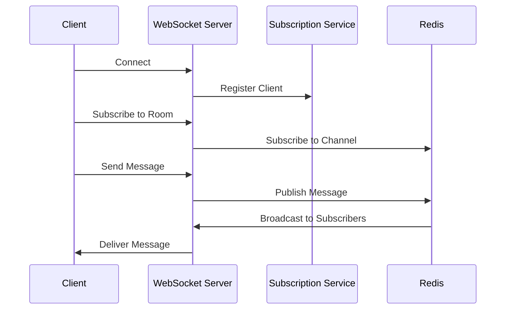

# Scalable WebSocket Server with Redis Pub/Sub

A scalable WebSocket server implementation using Redis Pub/Sub for message distribution across multiple server instances. This architecture allows for horizontal scaling while maintaining real-time message delivery across all connected clients.

## Architecture Overview


### Core Components

1. **WebSocket Server Layer**
   - Handles client connections
   - Manages WebSocket lifecycle
   - Routes messages to appropriate handlers

2. **Redis Manager (Singleton)**
   - Manages Redis connections
   - Handles Pub/Sub operations
   - Ensures single Redis connection pool

3. **Subscription Service**
   - Tracks active WebSocket connections
   - Manages room subscriptions
   - Handles message broadcasting

4. **Message Flow**


## Features

- Real-time bidirectional communication
- Horizontally scalable
- Redis-based message persistence
- Automatic reconnection handling
- Multiple room support
- TypeScript for type safety

## Installation

1. Clone the repository
```bash
git clone https://github.com/omkargade04/scalable-websocket-server.git
cd scalable-websocket-server
```

2. Install dependencies
```bash
npm install
```

3. Configure Redis
```bash
cd docker
docker-compose up -d
```

4. Start the server
```bash
npm start
```

## Project Structure

```
src/
├── managers/
│   └── RedisManager.ts     # Redis connection management
├── services/
│   ├── WebSocketService.ts # WebSocket handling
│   └── SubService.ts       # Subscription management
├── types/
│   └── types.ts           # TypeScript interfaces
├── utils/
│   └── helper.ts         # Utility functions
└── index.ts               # Application entry point
```

## Usage

### Connect to WebSocket Server
```javascript
const ws = new WebSocket('ws://localhost:8080');
```

### Subscribe to a Room
```javascript
ws.send(JSON.stringify({
    type: 'SUBSCRIBE',
    room: 'room1'
}));
```

### Send Message to Room
```javascript
ws.send(JSON.stringify({
    type: 'SEND_MESSAGE',
    roomId: 'room1',
    message: 'Hello, World!'
}));
```

### Unsubscribe from Room
```javascript
ws.send(JSON.stringify({
    type: 'UNSUBSCRIBE',
    room: 'room1'
}));
```

## Message Types

| Type | Description | Payload |
|------|-------------|---------|
| SUBSCRIBE | Join a room | `{ room: string }` |
| UNSUBSCRIBE | Leave a room | `{ room: string }` |
| SEND_MESSAGE | Send message to room | `{ roomId: string, message: string }` |

## Scaling

The application can be scaled horizontally by running multiple instances behind a load balancer. Redis Pub/Sub ensures message delivery across all instances.

```bash
# Start multiple instances
PORT=8080 npm start
PORT=8081 npm start
PORT=8082 npm start
```

## Development

### Running in Development Mode
```bash
npm run dev
```

### Building
```bash
npm run build
```

## API Documentation

### RedisManager

```typescript
class RedisManager {
    // Get singleton instance
    static getInstance(): RedisManager;
    
    // Connect to Redis
    connect(): Promise<void>;
    
    // Publish message to channel
    publish(channel: string, message: string): Promise<void>;
    
    // Subscribe to channel
    subscribe(channel: string, callback: (message: string) => void): Promise<void>;
}
```

### SubscriptionService

```typescript
class SubscriptionService {
    // Add new WebSocket subscription
    addSubscription(ws: WebSocket): string;
    
    // Add room to subscription
    addRoomToSubscription(id: string, room: string): void;
    
    // Remove room from subscription
    removeRoomFromSubscription(id: string, room: string): void;
}
```

## Error Handling

The application implements comprehensive error handling:

1. **WebSocket Errors**
   - Connection failures
   - Message parsing errors
   - Protocol errors

2. **Redis Errors**
   - Connection failures
   - Pub/Sub errors
   - Timeout handling

3. **Application Errors**
   - Room management errors
   - Message broadcast failures
   - Invalid message formats

## Contributing

1. Fork the repository
2. Create your feature branch (`git checkout -b feature/amazing-feature`)
3. Commit your changes (`git commit -m 'Add amazing feature'`)
4. Push to the branch (`git push origin feature/amazing-feature`)
5. Open a Pull Request

## License

This project is licensed under the MIT License - see the [LICENSE](LICENSE) file for details

## Author

Your Name - [@Omkar Gade](https://github.com/omkargade04)

## Acknowledgments

- Redis for the robust pub/sub system
- ws package for WebSocket implementation
- TypeScript team for the amazing type system